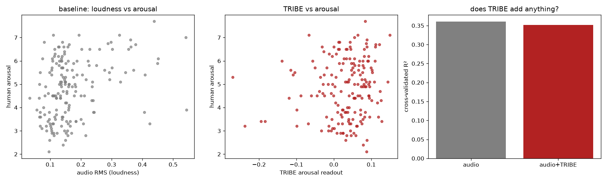
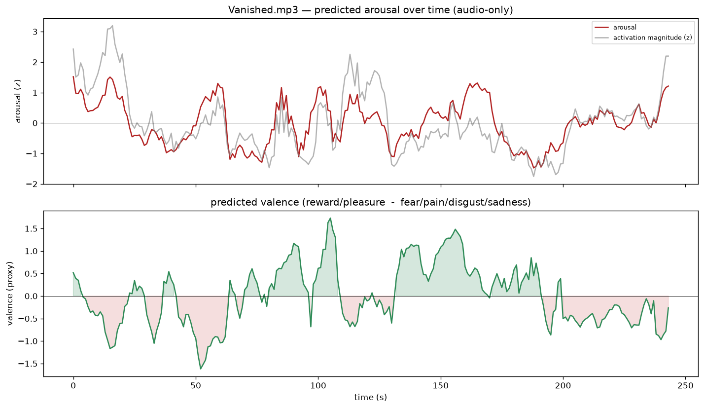

# Vookley

Predicting the emotional response to audio *before* you publish it, built on
Meta's [TRIBE](https://github.com/facebookresearch/tribev2) fMRI-encoding model
and [Neurosynth](https://neurosynth.org/) meta-analysis.

*176 human-rated songs (DEAM dataset). A cheap audio baseline explains ~36% of the
variance in human arousal (cross-validated). Adding TRIBE's neural features adds
nothing (R² 0.361 vs 0.351).*

## How it works

Two stages, run in two isolated environments (their dependencies conflict).

**Stage 1, brain map** (`run_brain.py`): audio goes into TRIBE, out comes a
predicted fMRI activation tensor on the fsaverage5 cortical surface
(`[n_segments, 20484]`, 1 Hz).

**Stage 2, emotion map** (`emotion_map.py`): the brain tensor is compared against
Neurosynth reverse-inference term maps (NiMARE `MKDAChi2`), projected from MNI152
volume space onto the fsaverage5 surface (nilearn `vol_to_surf`), then reduced by
spatial pattern correlation to arousal and valence axes over time.

## The validation experiment

`deam_tribe_batch.py` runs TRIBE over a sample of [DEAM](https://cvml.unige.ch/databases/DEAM/)
clips (music with human valence/arousal ratings). `deam_validate.py` then runs the
decisive test, **incremental validity**: does an audio baseline *plus* TRIBE beat
the audio baseline *alone* at predicting human arousal, under cross-validation?

It does not. And a Neurosynth-free readout (raw activation magnitude) was flat too,
so this is not a wiring artifact. The audio baseline alone reaches cross-validated
R² of 0.36; TRIBE adds nothing on top.

